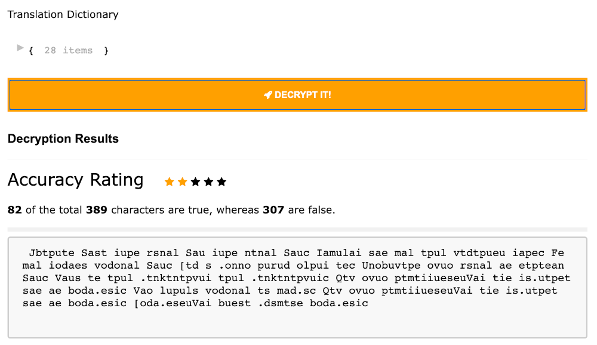

# String Encryption (Unicode-Shifting) - Homework1

## 1. Setup configuration

- **Please go to the link below to access the application**
  - https://azfunc-string-encryption.azurewebsites.net/home
- Follow the steps below to run in the local environment
  - [Download nodeJs 18 and above](https://nodejs.org/en/download)
  - Downloading the project from github
    - https://github.com/hidayet-aydin/string-encryption
  - Go to the project directory
  - Open terminal
  - Install all packages
    - `$ npm i`
  - Running local server
    - `npm run dev`
  - Open your browser and go to
    - http://localhost:3001/

## 2. Usage

### 2.1. SignUp & SignIn

In online usage, a login page welcomes the user. There is no login page in local use

### 2.2. Plain Text

A random lorem ipsum text comes to the plain text field. An optional text can be pasted into this field.

### 2.3. Encryption with Shifting

### 2.4. Histogram Drawing

### 2.5. Reference Text

### 2.6. Decryption Results

